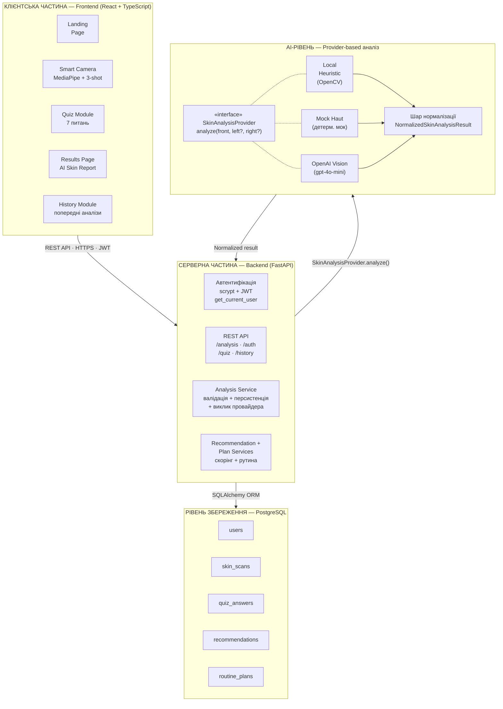
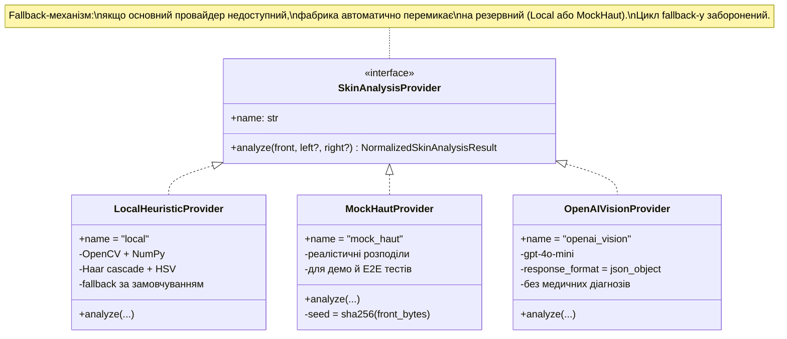

# Рисунки до розділу 3.4 — Архітектура SkinMatch

У цій папці лежать рисунки у SVG/PNG форматах, готові до вставки в Google Docs:

- `figure-3.1-architecture.svg` — загальна 4-рівнева архітектура (Frontend ↔ Backend ↔ AI ↔ Storage)
- `figure-3.2-providers.svg` — UML-діаграма provider-based архітектури AI
- `figure-3.3-fusion.svg` — confidence-aware fusion: правила об'єднання AI та квизу

## Як вставити в Google Docs

**Варіант А — SVG напряму (швидко):**
1. У Google Docs: `Вставка → Зображення → Завантажити з комп'ютера`.
2. Вибрати `figure-3.1-architecture.svg` або `figure-3.2-providers.svg`.
3. Google автоматично сконвертує у растрове зображення.

**Варіант Б — попередньо в PNG (вище якість для друку):**
1. Відкрити SVG-файл у Chrome (`файл → відкрити`).
2. Натиснути правою кнопкою → `Зберегти зображення як…` → `PNG`.
3. Завантажити PNG у Google Docs.

**Варіант В — через mermaid.live** (якщо хочеш сам відредагувати):
1. Відкрити https://mermaid.live
2. Вставити Mermaid-код з блоків нижче.
3. Експортувати як PNG/SVG.

---

## Mermaid-source для редагування

### Рисунок 3.1 — Архітектура системи

### Рисунок 3.2 — Provider-based архітектура AI

---

## Підписи під рисунками (для вставки в Google Docs)

> **Рисунок 3.1.** Архітектура AI-орієнтованої системи персоналізованого аналізу шкіри SkinMatch. Чотири рівні (клієнтський застосунок, серверна частина, AI-рівень, рівень зберігання) взаємодіють через REST API, інтерфейс провайдера та SQLAlchemy ORM.

> **Рисунок 3.2.** Provider-based архітектура AI-аналізу. Єдиний інтерфейс `SkinAnalysisProvider` визначає контракт `analyze()`, який реалізують три конкретні провайдери: локальний евристичний (OpenCV), детермінований мок (Mock Haut) та OpenAI Vision. Fallback-механізм забезпечує безперервність роботи при недоступності основного провайдера.

> **Рисунок 3.3.** Довірочно-зважене об'єднання сигналів AI та квизу. Модель скорингу враховує рівень впевненості AI (`confidence_score`) при злитті незалежних джерел: при високій впевненості (≥0.75) AI домінує у визначенні типу шкіри й концернів; при середній (0.50–0.75) AI-сигнали ослабляються лінійно; при низькій (<0.50) пріоритет переходить до самооцінки користувача у квизі, або до нейтрального значення NORMAL у разі відсутності відповіді. Підсумкова вага концерну обчислюється як максимум між вагою з квизу та зваженою (за довірою) вагою з AI.
